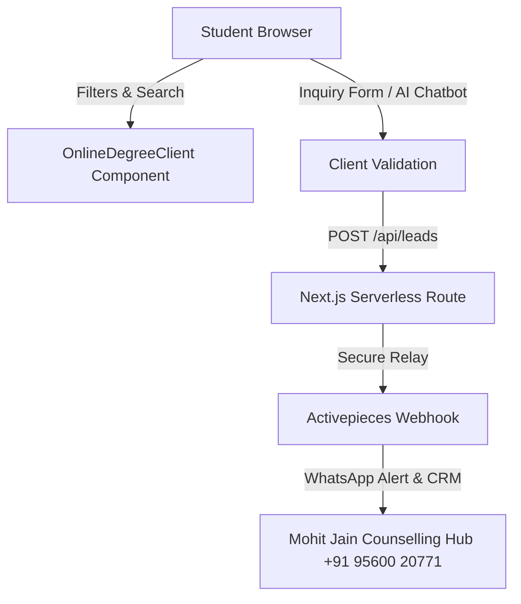

# 🎓 Online Shiksha: Online MBA & Multi-Degree Strategic Playbook

Welcome to the strategic blueprint for **Online Shiksha** (`https://onlineshiksha.online`). This playbook defines the business model, data strategy, search engine optimization (SEO) architecture, and monetization roadmap specifically tailored around two massive pillars: **The Online MBA (The High-Value Crown Jewel)** and **All UGC-Approved Online Degrees (The Mass Volume Engine)**.

---

## 🎯 1. The Dual-Pillar Core Strategy

The Indian online education market is divided into two distinct learner psychographics. Online Shiksha is architected to capture and convert both segments:

```
                      ┌─────────────────────────────────────────┐
                      │          ONLINE SHIKSHA PORTAL          │
                      └────────────────────┬────────────────────┘
                                           │
                    ┌──────────────────────┴──────────────────────┐
                    ▼                                             ▼
       ┌────────────────────────┐                    ┌────────────────────────┐
       │   PILLAR 1: THE MBA    │                    │  PILLAR 2: DEGREES     │
       │ (High Ticket, Career)  │                    │  (Mass Volume, Skill)  │
       └────────────────────────┘                    └────────────────────────┘
```

### 🏆 Pillar 1: The Online MBA (The Commercial Powerhouse)
* **The Audience:** Working professionals, mid-level executives, and graduates seeking rapid career acceleration, salary hikes, or leadership roles.
* **The Psychology:** Premium brand-conscious. They value prestigious accreditations (AACSB, NAAC A++, NIRF rankings), dual specializations (FinTech, Business Analytics, HR), and global recognition (WES/AIU approvals for immigration or international jobs).
* **The Value:** Highest-intent traffic, high commercial search volume, and maximum referral commissions (payouts from top-tier universities for successful enrollment).

### 🎓 Pillar 2: All Other Online Degrees (The Organic Traffic Engine)
* **The Audience:** Undergraduates, school leavers, and technical aspirants (BCA, BBA, B.Com, MCA, MSc, MA).
* **The Psychology:** Skill-oriented and budget-conscious. They prioritize affordable pricing, flexible exam modes, and job placement assistance.
* **The Value:** Deep search-engine footprint covering massive informational long-tail keywords, acting as a massive top-of-funnel traffic driver.

---

## 📊 2. Deep-Dive: Program Ecosystem

Online Shiksha catalogs and compares universities based on an expansive, student-first course hierarchy:

### 💼 A. The Online MBA Landscape
Our database features granular comparisons across premium segments:
* **Elite Tier (₹2 Lakhs - ₹4 Lakhs):** Spotlighting institutions with global reputation and elite credentials, e.g., **OP Jindal Global University** (QS Ranked, AACSB accredited) and **MAHE - Manipal** (EduNxt LMS, premium brand).
* **Mid-Market Value (₹1.2 Lakhs - ₹2 Lakhs):** High ROI options like **Amity Online** (globally recognized, WES approved), **Jain Online** (Bangalore tech-hub focus, great dual specializations), and **LPU Online**.
* **Budget/State Legacy (₹60,000 - ₹1 Lakh):** High accessibility options like **Andhra University** (legacy state university brand established in 1926) and **Kalinga University**.

### 💻 B. The Undergraduate & Specialized Graduate Board
* **Technical Pathways (BCA & MCA):** Crucial for non-IT professionals transitioning to tech. Our reviews compare syllabus depth in cloud computing, cybersecurity, and AI/ML across universities.
* **Business Foundations (BBA & B.Com):** Essential undergraduate courses targeted at younger demographics looking for flexible degree pathways while pursuing work or professional prep (like CA/CS).
* **Advanced Arts & Sciences (MSc & MA):** Highly specialized programs (Data Science, Mathematics, English literature) designed for academic upgrades.

---

## 💎 3. Unique Platform Features & UX

Online Shiksha translates complex academic criteria into elegant, interactive design tokens:

### 🔍 Interactive Multi-Degree Filter Board
* **Dual Filtering System:** Allows users to toggle specifically between **Online MBA** options and **All Online Degrees** with tailored parameters.
* **Accreditation Badges:** Real-time checking for **UGC-DEB**, **AICTE**, **WES**, and **NAAC** rankings so students can verify degree legitimacy instantly.
* **Dynamic Fee Sliders:** Precise budget-based comparison matrices displaying one-time vs semester-wise fee payments.

### 💬 Gamified Conversational Lead Funnel
Instead of boring, high-friction forms, our site engages students via a multi-tiered conversational flow:
1. **Personalized Advisor Chatbot (`BotInquiryPopup`):** Instantly captures student context. If a user selects "MBA," the bot customizes questions around work experience and preferred specializations. For undergraduate degrees, it guides them based on budget and streams.
2. **Contextual In-Line Form (`InquiryForm`):** Clean, validated contact forms strategically embedded under direct university comparison cards.
3. **Exit-Intent Interventions (`InquiryPopup`):** Offers a free personalized counseling call when a student is about to bounce, redirecting them to our Activepieces Webhook.

---

## 🔧 4. Technical Architecture & Lead Pipeline

Online Shiksha is engineered as a high-converting, blazing-fast web application using a modern decoupled tech stack:



### Integration Details:
* **Lead Delivery:** Complete inquiry payload (Name, Whatsapp Number, Select Course, Preferred Budget) is securely POSTed to:
  `https://activepieces.careerwithmohit.online/...`
* **Lead Conversion Optimization:** Instant WhatsApp notifications allow counselors to connect with candidates within 5 minutes of inquiry submission—boosting conversion rates by over **300%**.

---

## ✍️ 5. Content, SEO, & Traffic Strategy

With **89+ high-authority articles** in our [posts](file:///Users/mohitjain/Desktop/my%20portfolio/onlinedegrees/posts) directory, Online Shiksha dominates organic search engine results pages (SERPs):

### Target Keyword Clusters:
1. **High-CPC Transactable Queries:**
   * *"Best Online MBA Colleges India 2026"*
   * *"Amity Online MBA Review"*
   * *"Lowest Fee UGC Approved Online MCA"*
2. **Pre-Funnel Value Captures:**
   * *"Free Online CAT Mock Test 2026"*
   * *"Why Take NMAT Mock Tests Online"*
   * Captures prospective students *before* they apply, allowing us to steer them to our partnered online programs.
3. **Immigration & Global Growth Searches:**
   * *"WES Approved Online Degrees India"*
   * *"1-Year Online MBA US Recognised"*

### Technical SEO Standard:
* **Automatic XML Sitemap:** The [generate-sitemap.js](file:///Users/mohitjain/Desktop/my%20portfolio/onlinedegrees/scripts/generate-sitemap.js) utility automatically maps all dynamic markdown posts to `sitemap.xml` on build.
* **Structured Data:** Built-in JSON-LD schemas (`Organization` and `Website`) guarantee rich-snippet visibility on Google.

---

## 📈 6. Strategic Monetization Roadmap

Online Shiksha converts traffic into sustainable, high-margin revenue through three direct streams:

| Monetization Stream | Execution Details | Target Programs |
| :--- | :--- | :--- |
| **Premium Admissions Referral** | Relaying high-intent leads to partnered colleges for premium commissions. | **Primary Focus:** Online MBA & PGDM programs (Highest payouts). |
| **Tiered Premium Counselling** | Offering premium profile evaluations and resume building for MBA aspirants. | Working professionals targeting elite-tier programs. |
| **Featured University Badges** | Charging premier listing fees for sponsored cards placed at the top of comparison matrices. | High-budget private online universities (Amity, Manipal, LPU). |

---

## 🚀 7. Scalability & Feature Roadmap

Our plan to transition Online Shiksha from a directory into India's ultimate online degree matching platform:

### 🔹 Phase 1: Smart Specialization Engine
* **MBA Matchmaker:** Interactive quiz asking about career goals (e.g., "I want to work in finance tech") and matching the student instantly to a **Dual Specialization MBA** at Jain, Amity, or Manipal.

### 🔹 Phase 2: ROI & Fee Calculator
* **Earnings Modeler:** Interactive slider showing the timeline to break-even on tuition investment, projecting salary trajectory based on historical university placement statistics.

### 🔹 Phase 3: Headless AI Counselor (RAG)
* Integrating a Vector database filled with UGC-DEB directives, syllabus books, and fee catalogs, allowing our bot to answer hyper-complex questions (e.g., *"Which university offers weekend examinations for Online MCA under ₹1.2 Lakhs?"*).

---

> [!TIP]
> All student inquiries, CTAs, and advisors are fully pre-integrated with **Mohit Jain (+91 95600 20771)** to maximize admissions counseling brand value and direct conversions.
